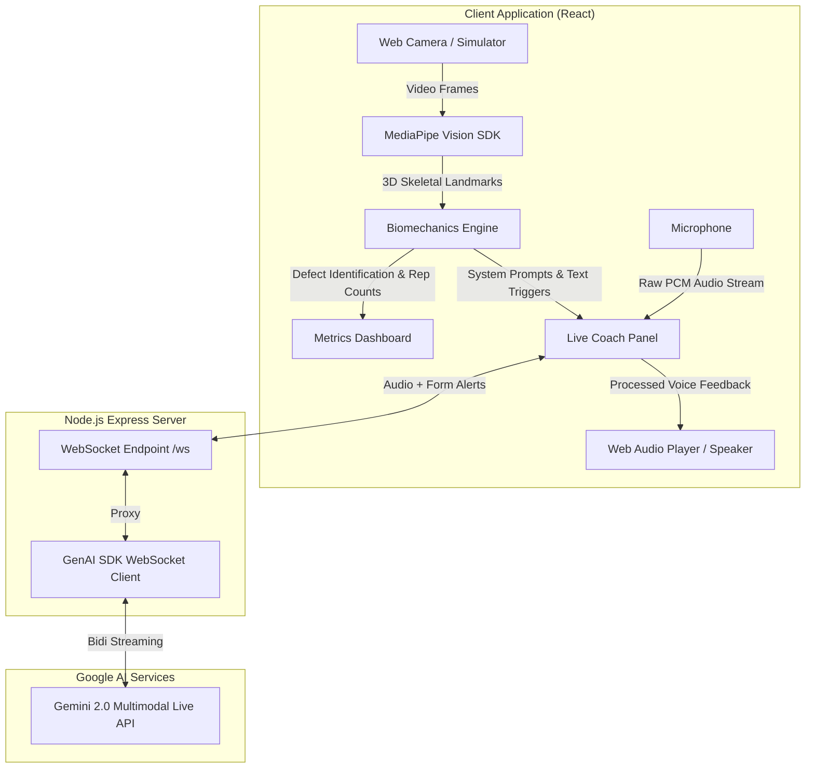

# System Architecture & Flow Design

Here is the architectural breakdown and real-time execution flow for the AI Biomechanics Coach application.

## 1. Architectural Diagram (Mermaid)

This diagram outlines the component architecture, showing how the frontend vision engine communicates with the server-side AI model to provide real-time coaching.



---

## 2. Real-Time Processing Flow Diagram (ASCII)

This ASCII flow diagram explains the exact chronological data flow from the moment the user moves, to the moment they hear feedback from the AI coach.

```text
 1. SENSOR CAPTURE
 +--------------------+       +--------------------+
 |  Web Camera Input  |       |  Microphone Input  |
 +--------------------+       +--------------------+
           |                            |
           v (Frames @ 30FPS)           v (PCM Audio Float32)
 +--------------------+       +--------------------+
 | MediaPipe Pose ML  |       | Audio Worklet Node |
 | & Hand Landmarker  |       | (Downsamples 16kHz)|
 +--------------------+       +--------------------+
           |                            |
           v (x, y, z points)           |
 2. DATA PROCESSING                     |
 +----------------------------------+   |
 | Biomechanics Engine (App.tsx)    |   |
 | - Calculates joint angles        |   |
 | - Identifies form errors         |   |
 | - Tracks rep/pose hold state     |   |
 +----------------------------------+   |
           |                            |
           v (String: "[POSTURE ALERT]")|
 3. PACKETIZATION                       |
 +----------------------------------+   |
 | LiveCoachPanel.tsx (State Mngr)  |   |
 | - Anti-spam throttling           |<--+
 | - JSON formatting                |
 +----------------------------------+
           | (WebSocket: Audio + JSON String Cues)
           v
 4. BACKEND PROXY
 +----------------------------------+
 | Node.js Express Server (/ws)     |
 | - Bridges browser WS to Google   |
 | - Injects System Instructions    |
 +----------------------------------+
           | (Bidirectional GenAI Stream)
           v 
 5. AI INFERENCE & SYNTHESIS
 +----------------------------------+
 | Gemini Multimodal Live API       |
 | - Reads context                  |
 | - Synthesizes accurate response  |
 +----------------------------------+
           | (Voice Output / Audio PCM Base64)
           v
 6. FEEDBACK DELIVERY
 +----------------------------------+
 | WebAudio Player (Frontend)       |
 | - Decodes Base64 to ArrayBuffer  |
 | - Pushes to Speaker              |
 +----------------------------------+
```
